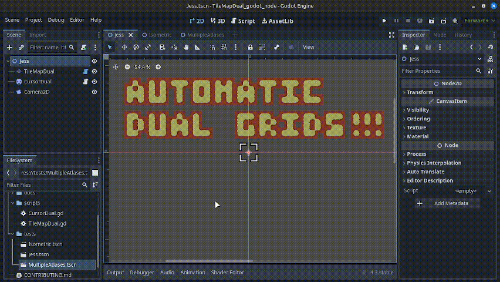
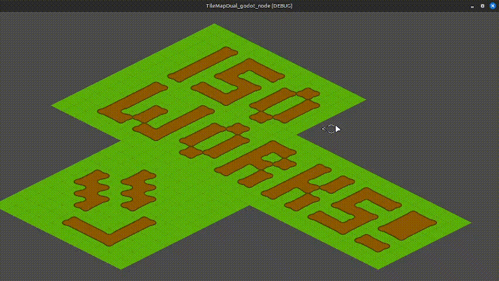

# TileMapDual Godot Node

Introducing *TileMapDual*: a simple, automatic and straightforward custom `TileMapLayer` node for [Godot](https://github.com/godotengine/godot) that provides a real-time, in-editor and in-game dual-grid tileset system, for both **square** and **isometric** grids.
This dual-grid system, [as explained by Oskar Stålberg](https://x.com/OskSta/status/1448248658865049605), reduces the number of tiles required from 47 to just 15 (yes, fifteen!!), rocketing your dev journey!  

Not only that, but if your tiles are symmetrical, you can get away with drawing only 6 (six!) tiles and then generating the 15-tile-tilesets used by *TileMapDual*, thanks to tools like [Wang Tile Set Creator](https://github.com/kleingeist37/godot-wang-converter).  

## Advantages

Using a dual-grid system has the following advantages:  
- Only [15](https://user-images.githubusercontent.com/47016402/87044518-ee28fa80-c1f6-11ea-86f5-de53e86fcbb6.png) tiles are required for autotiling, instead of [47](https://user-images.githubusercontent.com/47016402/87044533-f5e89f00-c1f6-11ea-9178-67b2e357ee8a.png)
- The tiles can have perfectly rounded corners
- The tiles align to the world grid

## Installation and usage

Just copy the `TileMapDual.gd` script to your project to start using the new custom node.  

You have to create a regular `TileMapLayer` with your own 2x2 tileset, following the [standard godot tileset](https://user-images.githubusercontent.com/47016402/87044518-ee28fa80-c1f6-11ea-86f5-de53e86fcbb6.png).
You just need to quickly sketch your level with the fully-filled tile, indicated here:

Then, create a `TileMapDual` node and assign the `TileMapLayer` to it. Just click the `Update in Editor` checkbox, and the dual grid will be automatically configured and generated in real-time.
Any change in the `TileMapLayer` will be updated by simply clicking the checkbox again!  

You can also freeze the tileset by activating the `Freeze` checkbox, to avoid accidental updates, both in-editor and in-game.

You can modify the dual tileset in-game by calling the following methods. An example is included in the custom `CursorDual` node, based on Jess's implementation.

- `fill_tile(world_cell)`: Fill a given world cell and update the corresponding dual tiles.
- `erase_tile(world_cell)`: Erase a given world cell and update the corresponding dual tiles.

Two more public methods are available, although you may not need them in most cases:

- `update_tile(world_cell)`: Update the displayed tiles around a given world cell. This is the fastest method to update specific cells.  
- `update_tileset()`: Update the entire tileset, offsetting itself by half a cell, and updating all tiles at once. This is what happens when you click the `Update in Editor` button.  

To achieve the best performance, only the fully-filled tile used for sketching in the World grid is used for autotiling in the `TileMapDual`. This approach allows the World tileset to be used for other purposes, such as having an extended tileset with rocks, etc.  

## Isometric tilesets

Isometric tilemaps are now compatible with the `TileMapDual` node.  
You heard that right, isometric, as in 'isometric'. It works automatically, out of the box. Isometric tilemaps! yayyyy!

To use isometric tilemaps, you only need to follow an isometric-ed version of the [standard godot tileset](https://user-images.githubusercontent.com/47016402/87044518-ee28fa80-c1f6-11ea-86f5-de53e86fcbb6.png) template that we previously used for square tilemaps. Here it is:

That's it. Just 15 tiles for isometric autotiling. I love it.

## Why?

Previous implementations of a dual-grid tileset system in Godot
by [GlitchedInOrbit](https://github.com/GlitchedinOrbit/dual-grid-tilemap-system-godot-gdscript)
and [jess::codes](https://github.com/jess-hammer/dual-grid-tilemap-system-godot)
used an inverted version of the [standard 16-tile template](https://user-images.githubusercontent.com/47016402/87044518-ee28fa80-c1f6-11ea-86f5-de53e86fcbb6.png) (although Jess's tileset is provided as an example in this repo).
This is a potential source of headaches, and this release corrects said inversion.  

This release also implements modern **TileMapLayers** instead of the deprecated TileMap node.  

Most importantly, this release simplifies the process by introducing the dual grid system as a simple **custom node** that runs **automatically** and **in-editor**, making it easy to integrate into your own projects.  

Oh, and also... You can use **isometric tilesets!**  

## To-do

- Animations I guess
- I am personally not interested in hex grids right now, but I am open to pull requests!

## License

This project is Free and Open Source Software, released under the [GNU Lesser General Public License v3.0](https://www.gnu.org/licenses/lgpl-3.0.en.html).  

**TL;DR:** You can use this project for **free**, even **commercially**, with the only condition that you **share back any significant  modifications *to this specific code*** - NOT your entire game, just the derivatives of the code provided here - so that the Godot community keeps thriving. Thanks!

## References

- [Dual grid Twitter post by Oskar Stålberg](https://x.com/OskSta/status/1448248658865049605)
- ['Programming Terrain Generation' video by ThinMatrix](https://www.youtube.com/watch?v=buKQjkad2I0)
- ['Drawing Fewer Tiles' video by jess::codes](https://www.youtube.com/watch?v=jEWFSv3ivTg)
- [jess::codes implementation in C#](https://github.com/jess-hammer/dual-grid-tilemap-system-godot)
- [GlitchedInOrbit implementation in GDScript](https://github.com/GlitchedinOrbit/dual-grid-tilemap-system-godot-gdscript)
- [Wang Tile Set Creator](https://github.com/kleingeist37/godot-wang-converter)
- [Webtyler tool, to convert from 15-tile sets to 47-tile sets](https://wareya.github.io/webtyler/)

## Feedback

Please feel free to contact me to provide feedback, suggestions, or improvements to this project :D  
- [Twitter (@GilaPixel)](https://x.com/gilapixel)
- [Instagram (@GilaPixel)](https://www.instagram.com/gilapixel/)
- [Reddit (/u/pgilah)](https://www.reddit.com/u/pgilah/)
