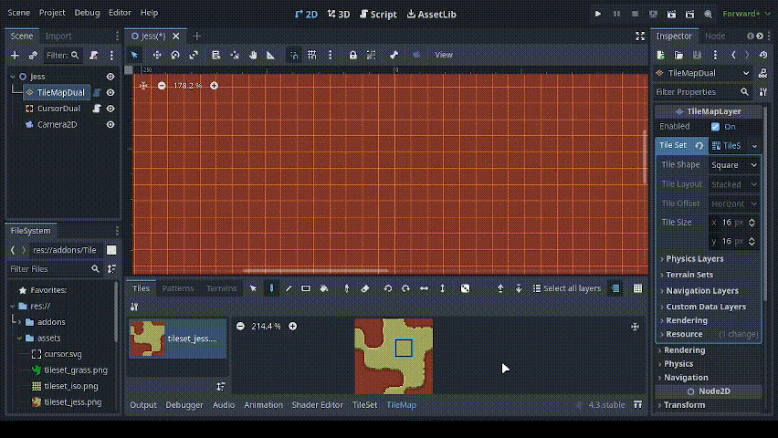
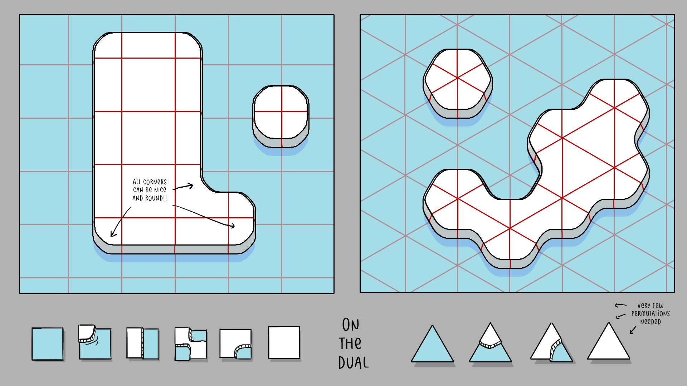
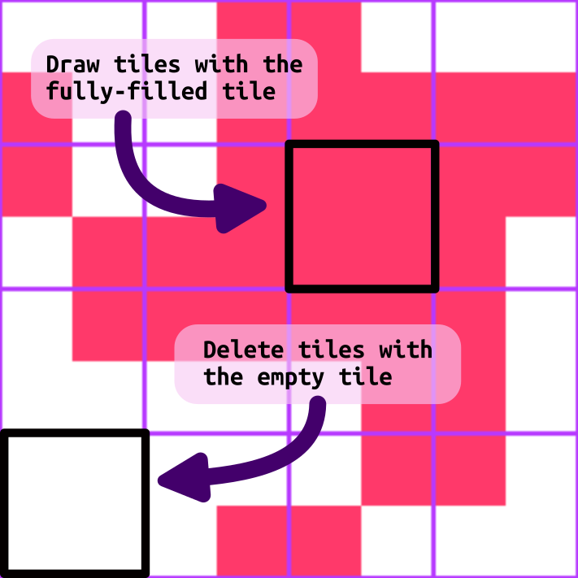
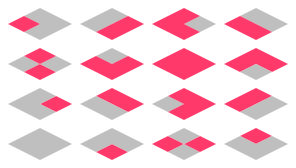
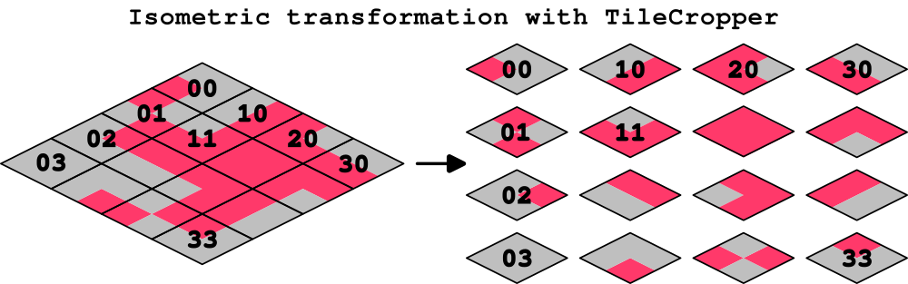

# TileMapDual

Introducing *TileMapDual*: a simple, automatic and straightforward custom `TileMapLayer` node for [Godot](https://github.com/godotengine/godot) that provides a real-time, in-editor and in-game dual-grid tileset system, for both **square** and **isometric** grids.  

This dual-grid system, [as explained by Oskar Stålberg](https://x.com/OskSta/status/1448248658865049605), reduces the number of tiles required from 47 to just 15 (yes, fifteen!!), rocketing your dev journey!  

  

Not only that, but if your tiles are symmetrical, you can get away with drawing only 6 (six!) tiles and then generating the 15-tile-tilesets used by *TileMapDual*, thanks to tools like [Wang Tile Set Creator](https://github.com/kleingeist37/godot-wang-converter).  

  


## Advantages

Using a dual-grid system has the following advantages:  
- Only [15](https://user-images.githubusercontent.com/47016402/87044518-ee28fa80-c1f6-11ea-86f5-de53e86fcbb6.png) tiles are required for autotiling, instead of [47](https://user-images.githubusercontent.com/47016402/87044533-f5e89f00-c1f6-11ea-9178-67b2e357ee8a.png)
- The tiles can have perfectly rounded corners
- The tiles align to the world grid


## Installation

TileMapDual is installed as a regular Godot plugin.
Just copy the `addons/TileMapDual` folder to your Godot project, and enable it on *Project*, *Project settings...*, *Plugins*.  


## Usage

You have to create a `TileMapDual` node with your own tileset, and set it up with the appropriate tile shape and orientation, tile and sprite sizes, and terrains.

- Note: Automatic terrain generation is currently disabled because it kept double generating terrains


It's a bit complicated, but here is how to set up a Hexagonal Vertical spritesheet:


https://github.com/user-attachments/assets/3fa6b674-83b4-4c8c-b341-d1105679a4c8


You can even edit the terrain configuration in real-time:


https://github.com/user-attachments/assets/5331582b-f480-4b88-873a-a3a2cd38920b


# Important Note: The rest of this README may be outdated.

And that's it! You can now start sketching your level with the fully-filled tile, indicated here:  



You can also sketch with the empty tile in the bottom-left corner, or erase tiles as usual. The dual grid will update in real time as you draw!  

The `examples` folder has several example scenes. A simple use case with square tiles is provided in the **Jess** scene.

You can modify the dual tileset in-game by calling the `draw()` method as follows:  
```gdscript
TileMapDual.draw(cell: Vector2i, tile: int = 1, atlas_id: int = 0)
```
Where:  
- `cell` is a vector with the cell position
- `tile` is `1` to draw the full tile (default), `0` to draw the empty tile, and `-1` to completely remove the tile
- `atlas_id` is the atlas id of the tileset to modify, 0 by default

> Note: the new `draw()` method replaces the deprecated `fill_tile()` and `erase_tile()` methods.

The included `CursorDual` node provides an example use case to modify the tiles in-game.  

An additional method, `TileMapDual.update_full_tileset()`, is available to refresh the entire dual grid. It should not be necessary, but may come in handy in case of a hypothetical bug.  


## Isometric tilesets

Isometric tilemaps are compatible with the `TileMapDual` node.  
You heard that right, isometric, as in 'isometric'. It works automatically, out of the box. Isometric tilemaps! yayyyy!  

  

An use example is provided in the **Isometric** scene.  

To use isometric tilemaps, all you need to do is follow an isometric-ed version of the [standard godot tileset](https://user-images.githubusercontent.com/47016402/87044518-ee28fa80-c1f6-11ea-86f5-de53e86fcbb6.png) template that we previously used for square tilemaps, as shown in the image below:  

  

This isometric tileset can be drawn by hand.
But it can also be drawn more easily using a tool like [TileCropper](https://github.com/pablogila/TileCropper), a Godot plugin that allows you to draw the tiles in one continuous image, to later separate the tiles as follows:  

  

That's it. Just 15 tiles for isometric autotiling. I love it.  


## Multiple atlases and layers

You can use multiple atlases in the same tileset. To change them in-game, make sure you call the `draw()` method described above with the desired `atlas_id`, which is `0` by default. An example is included with the custom `CursorDual` node, see the **MultipleAtlases** scene.  

Note that each atlas can handle 2 surfaces. To add more surfaces or tile variations on top of one another, consider using a second `TileMapDual` node with transparencies in your tileset, just as you would do with a regular `TileMapLayer`. An example is provided in the **MultipleLayers** scene.  


## Why?

This release simplifies the implementation of a dual-grid system by introducing a simple **custom node** that runs **automatically** and **in-editor**, making it easy to integrate into your own projects.  

Previous implementations of a dual-grid tileset system in Godot, mainly by
[jess::codes](https://github.com/jess-hammer/dual-grid-tilemap-system-godot) and
[GlitchedInOrbit](https://github.com/GlitchedinOrbit/dual-grid-tilemap-system-godot-gdscript),
were not automatic and required extensive manual configuration (at the time of writing).
These implementations also used an inverted version of the [standard 16-tile template](https://user-images.githubusercontent.com/47016402/87044518-ee28fa80-c1f6-11ea-86f5-de53e86fcbb6.png) (although Jess's tileset is provided as an example in this repo).
This is a potential source of headaches, and this release corrects said inversion.  

This release also implements modern **TileMapLayers** instead of the deprecated TileMap node.  

Plus, you can use **multiple atlases** in the same tileset.  

Oh, and also... You can use **isometric tilesets!**  


## License and contributing

This project is Open Source Software, released under the [MIT license](LICENSE). This basically means that you can do whatever you want with it. Enjoy!  

[This repo](https://https://github.com/pablogila/TileMapDual_godot_node/) is open to pull requests, just make sure to check the [contributing guidelines](CONTRIBUTING.md).
I personally encourage you to send back any significant improvements to this code so that the Godot community continues to thrive. Thanks!  


## References

- [Dual grid Twitter post by Oskar Stålberg](https://x.com/OskSta/status/1448248658865049605)
- ['Programming Terrain Generation' video by ThinMatrix](https://www.youtube.com/watch?v=buKQjkad2I0)
- ['Drawing Fewer Tiles' video by jess::codes](https://www.youtube.com/watch?v=jEWFSv3ivTg)
- [jess::codes implementation in C#](https://github.com/jess-hammer/dual-grid-tilemap-system-godot)
- [GlitchedInOrbit implementation in GDScript](https://github.com/GlitchedinOrbit/dual-grid-tilemap-system-godot-gdscript)
- [Wang Tile Set Creator](https://github.com/kleingeist37/godot-wang-converter)
- [Webtyler tool, to convert from 15-tile sets to 47-tile sets](https://wareya.github.io/webtyler/)

## Feedback

Please feel free to contact me to provide feedback, suggestions, or improvements to this project. You may also check the the [contributing guidelines](CONTRIBUTING.md) to submit an issue or a pull request  :D  
- [Twitter (@GilaPixel)](https://x.com/gilapixel)
- [YouTube (@GilaPixel)](https://www.youtube.com/@gilapixel)
- [Instagram (@GilaPixel)](https://www.instagram.com/gilapixel/)
- [Mastodon (@GilaPixel)](https://mastodon.gamedev.place/@GilaPixel)
- [Reddit (/u/pgilah)](https://www.reddit.com/u/pgilah/)

